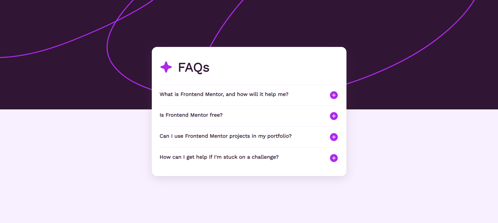

# Frontend Mentor - QR code component

This is a solution to the [FAQ accordion](https://www.frontendmentor.io/challenges/faq-accordion-wyfFdeBwBz).

- [Overview](#overview)
  - [The challenge](#the-challenge)
  - [Screenshot](#screenshot)
  - [Links](#links)
- [My process](#my-process)
  - [Built with](#built-with)
  - [What I learned](#what-i-learned)
  - [Continued development](#continued-development)
  - [Useful resources](#useful-resources)
- [Author](#author)
- [Acknowledgments](#acknowledgments)

## Overview

### The challenge

The challenge is to build a FAQ accordion that matches the provided design. Each opened section should collapse when another one is clicked.

### Screenshot

### Links

- Solution URL: [Github](https://github.com/Mohammed-Nedjima/FAQ-accordion.git)
- Live Site URL: [Github pages](https://mohammed-nedjima.github.io/FAQ-accordion/)

## My process

### Built with

- Semantic HTML5 markup
- CSS custom properties
- Flexbox
- Mobile-first workflow

### What I learned

-Practice semantic Html elements
-Practice CSS custom properties
-The usage of max-width property

## Author

- Linkedin - [Mohammed Ayoub Nedjima](https://www.linkedin.com/in/mohammed-ayoub-nedjima//profile/kaamiik)
- Frontend Mentor: - [@Mohammed-Nedjima](https://www.frontendmentor.io/profile/Mohammed-Nedjima)
